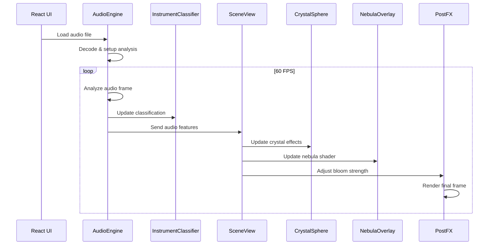

# Architecture Overview - OpenAI GPT-5 Music Visualizer

## Executive Summary

The OpenAI GPT-5 Music Visualizer is an Electron-based desktop application that creates ethereal, psychedelic, and cosmic visualizations driven by music analysis. Built with TypeScript, React, and Three.js, it processes audio from files or live capture to generate real-time visual effects that respond to musical characteristics.

## System Architecture

### High-Level Architecture

```mermaid
graph TD
    A[Audio Input<br/>Files | Live | System Audio] --> B[Audio Engine<br/>Web Audio API]
    B --> C[Feature Extraction<br/>FFT Analysis & Meyda]
    C --> D[Instrument Classification<br/>Heuristic Analysis]
    C --> E[Beat Detection<br/>Energy-based Algorithm]
    D --> F[Visualization Engine<br/>Three.js Scene Management]
    E --> F
    F --> G[Visual Effects<br/>Crystal Sphere | Nebula | Aurora]
    F --> H[Post-Processing<br/>Bloom | Effects Chain]
    I[UI Controls<br/>React Components] --> F
    I --> C
    J[Electron Main Process<br/>File System | Permissions] --> K[Preload Bridge<br/>Secure IPC]
    K --> I
```

### Core Components

#### 1. Electron Architecture
- **Main Process** (`app/main/`): Application lifecycle, file system access, window management, secure IPC
- **Preload Script** (`app/preload/`): Secure bridge between main and renderer processes
- **Renderer Process** (`app/renderer/`): UI and visualization logic running in Chromium

#### 2. Audio Processing Pipeline
- **AudioEngine** (`src/audio/AudioEngine.ts`): Web Audio API wrapper handling multiple input sources
- **Feature Extraction**: Real-time analysis using FFT and Meyda library
- **Beat Detection**: Energy-based algorithm with adaptive thresholding
- **Instrument Classification**: Heuristic analysis of frequency bands

#### 3. Visualization Engine
- **SceneView** (`src/three/SceneView.ts`): Main Three.js scene orchestrator
- **Effect Layers**: Modular visual components (Crystal Sphere, Nebula, Aurora, Starfield)
- **Post-Processing**: Bloom and effects chain using Three.js EffectComposer

## Data Flow Architecture

### Audio-to-Visual Pipeline

1. **Audio Acquisition**
   - File decoding via Web Audio API
   - Live capture through MediaDevices API
   - System audio capture via getDisplayMedia (macOS Screen Recording permission)

2. **Real-time Analysis** (60 FPS)
   - FFT analysis (1024 samples, 0.85 smoothing)
   - Frequency band separation (low/mid/high)
   - RMS energy calculation
   - Beat detection using rolling energy statistics

3. **Feature Mapping**
   - Audio features → Visual parameters
   - Instrument classification → Theme selection
   - Beat events → Effect triggers
   - Energy levels → Bloom intensity

4. **Rendering Pipeline**
   - Three.js scene updates
   - Shader uniform updates
   - Post-processing effects
   - Frame capture for recording

### Component Interaction Model



## Security Architecture

### Electron Security Model
- **Context Isolation**: Enabled for renderer process
- **Node Integration**: Disabled in renderer
- **Preload Bridge**: Minimal, typed API surface
- **CSP**: Content Security Policy enforced
- **Permissions**: macOS Screen Recording permission for system audio

### Data Protection
- **File Access**: Sandboxed through Electron's dialog API
- **Audio Data**: Processed locally, never transmitted
- **User Settings**: Stored locally as JSON presets

## Performance Architecture

### Optimization Strategies
- **Audio Processing**: 1024 FFT size for balance of quality/performance
- **Rendering**: Capped at 60 FPS with requestAnimationFrame
- **Memory Management**: Buffer reuse, geometry disposal, material cleanup
- **GPU Utilization**: WebGL2 with fallback to WebGL1 and 2D canvas

### Resource Management
- **Audio Buffers**: Decoded once, reused for playback
- **Geometry Caching**: Reuse of icosahedron and primitive geometries
- **Shader Compilation**: One-time compilation with uniform updates
- **Effect Cleanup**: Automatic disposal of expired visual effects

## Scalability Considerations

### Modularity
- **Effect System**: Pluggable visual effects with consistent interfaces
- **Audio Sources**: Abstracted input handling for multiple source types
- **Theme System**: JSON-based color and parameter configurations
- **Preset System**: Serializable visualization settings

### Extensibility Points
- **Custom Effects**: New visual effects can extend base effect classes
- **Audio Features**: Additional analysis can be plugged into feature extraction
- **Instrument Types**: Classifier can be extended with new instrument categories
- **Post-Processing**: Effect chain can accommodate new shader passes

## Technology Stack

### Core Technologies
- **Electron 31.3.0**: Cross-platform desktop framework
- **TypeScript 5.5.3**: Type-safe JavaScript development
- **React 18.3.1**: UI component framework
- **Three.js 0.166.1**: WebGL 3D graphics library
- **Meyda 5.6.3**: Audio feature extraction library

### Development Tools
- **Vite 5.3.3**: Fast build tool and dev server
- **ESLint/Prettier**: Code quality and formatting
- **Mocha/Chai/Sinon**: Testing framework
- **tsup**: TypeScript bundler for main/preload processes

### Audio Technologies
- **Web Audio API**: Native browser audio processing
- **MediaDevices API**: Microphone and system audio capture
- **FFT Analysis**: Fast Fourier Transform for frequency analysis
- **AudioWorklet**: Future consideration for heavy processing

## Deployment Architecture

### Build Pipeline
- **Multi-target Build**: Separate compilation for main, preload, and renderer
- **Asset Optimization**: Vite handles renderer assets and bundling
- **Type Checking**: Full TypeScript compilation validation
- **Code Quality**: ESLint and Prettier enforcement

### Distribution Strategy
- **Electron Builder**: Planned for application packaging
- **Code Signing**: Developer ID signing for macOS distribution
- **Auto-updates**: Future consideration for seamless updates
- **Platform Support**: Primary macOS, potential Windows/Linux support

## Integration Points

### External Dependencies
- **Operating System**: macOS Screen Recording API for system audio
- **Hardware**: Audio input/output devices, GPU for WebGL rendering
- **File System**: Local audio file access, preset storage
- **FFmpeg**: External binary for video encoding (optional)

### API Boundaries
- **IPC Bridge**: Type-safe communication between Electron processes
- **Web Audio API**: Browser-native audio processing
- **WebGL API**: GPU-accelerated graphics rendering
- **File System API**: Sandboxed file operations

## Quality Attributes

### Performance Targets
- **Real-time Processing**: <16ms frame time (60 FPS)
- **Audio Latency**: <50ms input to visual response
- **Memory Usage**: <500MB typical operation
- **CPU Usage**: <30% on modern hardware

### Reliability Requirements
- **Graceful Degradation**: 2D fallback when WebGL unavailable
- **Error Recovery**: Automatic restart of failed audio processing
- **Resource Cleanup**: Proper disposal of GPU resources
- **Cross-platform**: Consistent behavior across supported platforms

### Usability Goals
- **Immediate Feedback**: Visual response within one frame of audio input
- **Intuitive Controls**: Simple UI for complex visual parameters
- **Preset System**: Save/load favorite configurations
- **Recording Capability**: Export visualizations as video files

This architecture provides a solid foundation for ethereal music visualization while maintaining performance, security, and extensibility for future enhancements.